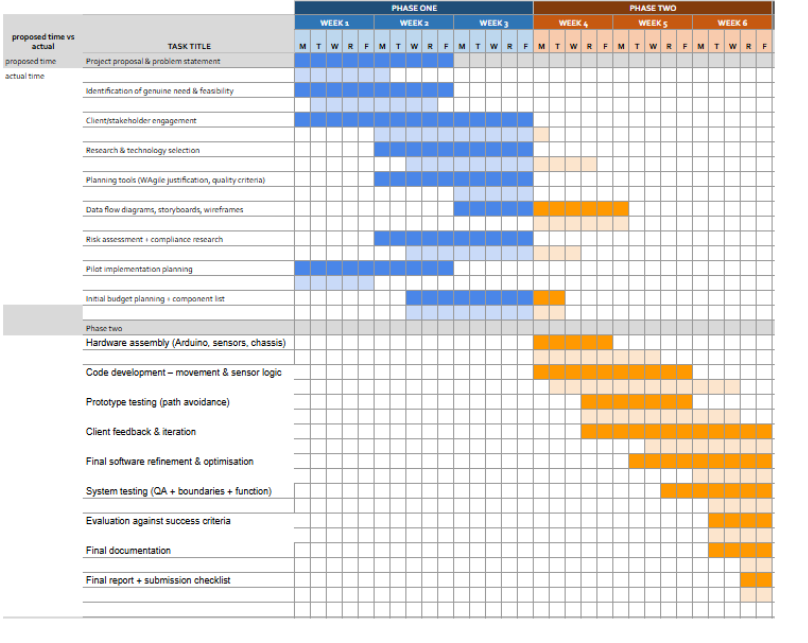

# Warehouse Robot Web Control System

## Overview

This project is a **MicroPython based web application** that allows a user to remotely control a robot and monitoring it via a Wi-Fi network. The system is designed for the Raspberry Pi Pico 2 W and demonstrates application of OOP, embedded systems, and web technologies in real world contexts. The robot can be directed to various warehouse aisles and provides live feedback on its status, including obstacle distance and last movement speed.

---

## Features

- **Secure Web Interface:**  
  Users must log in to access robot controls, this makes sure only authorized personnel can operate the robot.
  you can use the login information

admin@example.com : 
robotpass


an gif of this is here


- **Robot Movement Control:**  
  The web dashboard allows users to send the robot to any of six aisles or stop it instantly which is needed if there are safety issues present.

  in this gif they click the specific isle


- **Live Status Feedback:**  
  The interface displays real-time obstacle distance (via ultrasonic sensor) and the robot's last speed.


- **Safety Mechanisms:**  
  The robot automatically stops if an obstacle is detected within a minimum distance, preventing collisions.

- **Modular, OOP design :**  
  The codebase is organized into reusable classes (`Robot`, `WebServer`), which allows  maintainability and scalability.

---

## System Architecture

- **MicroPython (Raspberry Pi Pico 2 W):**  
  Runs all robot control and the web server .

- **Robot Class:**  
  Encapsulates all movement, sensor, and safety code.

- **WebServer Class:**  
  Handles HTTP requests, authentication, and UI rendering.

- **HTML & CSS:**  
  Responsive, user-friendly dashboard styled via embedded CSS.

- **File Structure:**
  ```
  project/
  ├── main.py
  └── py_scripts/
      ├── app.py
      ├── robot.py
      ├── web_server.py
      ├── html.py
      └── styles.py
  ```

---

## How It Works

1. **Startup:**  
   The system connects to the specified Wi Fi network and initializes the robot and web server. the wifi is hard coded so it has to be redone with each warehouse to connect to the wifi.

2. **User Authentication:**  
   Users have to log in with the hard code login information to access the dashboard.

3. **Robot Control:**  
   Users select a task (e.g., "Go to Aisle 3") via the UI. The server turns this into robot movement commands.

4. **Safety & Feedback:**  
   The robot uses an ultrasonic sensor to detect obstacles. If an obstacle is too close, movement is halted and the user is notified.

5. **Status Display:**  
   The dashboard updates with the latest sensor readings and robot speed after each command. although they are somewhat slow

---

## Key Code Components

- **`robot.py`:**  
  Defines the `Robot` class, handling all hardware interactions and movement logic.

- **`web_server.py`:**  
  Implements the `WebServer` class, managing HTTP requests, authentication, and command routing.

- **`html.py` & `styles.py`:**  
  Provide the HTML structure and CSS styling for the web dashboard.

- **`app.py`:**  
  Entry point for the application, initializing the WiFi, robot, and server.

- **`main.py`:**  
  Bootloader that safely imports and runs the main application, with error handling.

---


## Setup & Usage

1. **Hardware:**  
   - Raspberry Pi Pico W  
   - Motor driver, servos, ultrasonic sensor  
   - Wi Fi network credentials

2. **Deployment:**  
   - Copy all files to the Pico W filesystem, preserving the directory structure.
   - Edit WiFi credentials in `app.py` if needed.
   - Reset the Pico W;\  the web server will start automatically. you should also upload project to pico.

3. **Access:**  
   - Connect to the same WiFi network as the Pico W.
   - Open a browser and navigate to the IP address shown in the Pico W's serial output.
   - Log in using the credentials in `web_server.py` (default: `admin@example.com` / `robotpass`). you can change these although if you want in the web_server.py

---

## Alignment with Software Course Specifications

- **Project Planning & Design:**  
  The system demonstrates clear planning, modular design, and use of UML diagrams for documentation.

- **Implementation:**  
  Applies OOP, embedded programming, and web development good practices.

- **Testing & Evaluation:**  
  The code is structured for easy extension with unit tests and further evaluation.

- **Documentation:**  
  This README and incode comments provide a clear documentation for users and developers, especially for those people who may want to iterate upon the design.

---


## Credits

- Developed by [Dashiell Johnson]
- For the [SE task 3 Major work] 
- Nesa Number 38450042
- dashiell.johnson@education.nsw.gov.au
- alternative email, dashjohnson5@gmail.com

## completed gant chart

